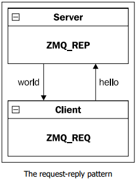

# Описание проекта

Это система для сбора данных о качестве сотовой связи и их визуализации на карте.

## 6.1 Схема архитектуры

Как всё работает. Сначала Android приложение собирает данные - это GPS координаты (практика 6) и параметры сотовой связи типа MCC, MNC, PCI, RSRP, RSRQ, RSSI, RSSNR (практики 7-9). Потом эти данные отправляются на сервер через ZMQ на порт 2222. Python сервер получает данные, обрабатывает их и сохраняет в базу данных PostgreSQL. База данных хранит всё в таблице user_equipment. А потом модуль graph.py читает данные из базы и показывает график на карте (практика 10).

Android приложение отправляет данные через ZMQ на Python сервер, сервер сохраняет в PostgreSQL, а graph.py читает и показывает график.

## 6.2 Описание DTO

Клиент отправляет на сервер JSON с такими полями. time - это время в формате день-месяц-год часы:минуты:секунды, например "25-12-2024 14:30:00". latitude - это широта из GPS, longitude - долгота из GPS. mcc - код страны, mnc - код сети, pci - ID соты. rsrp - мощность сигнала, rsrq - качество сигнала, rssi - уровень сигнала, rssnr - отношение сигнал к шуму.

Сервер отвечает просто: если всё ок, то отправляет "OK", если ошибка, то "ERR".

В базе данных есть таблица user_equipment. В ней хранятся все эти данные. Там есть id - номер записи, который создаётся автоматически. formatted_time - время. latitude и longitude - координаты. mcc, mnc, pci - параметры сотовой связи. rsrp, rsrq, rssi, rssnr - параметры сигнала.

## 6.3 Архитектура клиента Android

Структура проекта примерно такая. В папке android-client есть app, а в ней src/main/java/com/example/telephony с файлами MainActivity.java для главного экрана, LocationService.java для получения GPS, TelephonyService.java для получения данных сотовой связи, NetworkClient.java для отправки на сервер, DataCollector.java для сбора данных. Ещё есть res с layout для разметки и values для строк. И AndroidManifest.xml. Но точную структуру нужно уточнить. *

Приложение работает с потоками. Главный поток показывает интерфейс. Есть отдельный поток для GPS, который получает координаты. Есть поток для сотовой связи, который получает параметры связи. И есть поток для сети, который отправляет данные на сервер через ZMQ. Все фоновые операции делаются в отдельных потоках, чтобы не блокировать интерфейс. *

Для подключения к серверу используется адрес tcp://IP_сервера:2222 по протоколу ZMQ на порту 2222. Используется ZeroMQ с паттерном REQ-REP. Клиент создаёт REQ сокет и подключается к серверу. Вот пример кода на Python как это делается - создаётся контекст ZMQ, создаётся REQ сокет, подключаемся к tcp://127.0.0.1:2222, отправляем JSON данные, получаем ответ.

## 6.4 Архитектура сервера

Структура проекта такая. В папке server есть pythonserv с файлами server.py - это основной сервер который слушает порт 2222, graph.py для визуализации данных, client.py тестовый клиент, coordinates.txt файл с координатами. Ещё есть cserver с server.c - это TCP сервер на порту 8080, и client.c - TCP клиент. Но C сервер это просто пример, в основном проекте не используется. *

Python сервер работает в одном потоке. Сначала создаётся ZMQ сокет и он слушает порт 2222. Потом подключается к PostgreSQL. Потом в бесконечном цикле ждёт данные от клиента, парсит JSON, форматирует время, сохраняет в базу, отправляет ответ "OK" или "ERR". Запросы обрабатываются по очереди, один за другим.

C сервер это простой TCP сервер на порту 8080, но он не используется в основном проекте. *

"server.c" "client.c" Сначала создаётся сокет через функцию socket с параметрами AF_INET для IPv4 и SOCK_STREAM для TCP. Потом настраиваются опции сокета через setsockopt, чтобы можно было переиспользовать адрес. Потом создаётся структура sockaddr_in с адресом INADDR_ANY и портом 8080. Сокет привязывается к адресу через bind. Потом сервер начинает слушать через listen с очередью на 3 соединения. Когда приходит клиент, сервер принимает соединение через accept, получает новый сокет для общения с этим клиентом. Потом читает данные через read в буфер размером 1024 байта, выводит их на экран, отправляет ответ "Hello from server" через send, и закрывает сокеты через close.

 Клиент создаёт сокет через socket. Потом создаётся структура sockaddr_in с адресом сервера 127.0.0.1 и портом 8080. Адрес преобразуется через inet_pton. Потом клиент подключается к серверу через connect. После подключения отправляет сообщение "Hello from client" через send. Потом читает ответ от сервера через read в буфер, выводит его на экран, и закрывает сокет через close.

Сервер слушает на адресе tcp://*:2222 по протоколу ZMQ на порту 2222. Используется библиотека pyzmq, паттерн REQ-REP. Данные в формате JSON. Сервер принимает данные от Android клиентов.

База данных PostgreSQL находится на localhost:5432. База называется telephony_bd, пользователь postgres, хост localhost, порт 5432.

Модуль визуализации graph.py не имеет сетевых endpoint'ов. Он просто читает данные из PostgreSQL и показывает график через matplotlib.

Для работы Python сервера нужно установить psycopg2 для работы с PostgreSQL, pyzmq для ZMQ, matplotlib для графиков. Для C сервера ничего особенного не нужно, только стандартная библиотека C.

Поля со звёздочкой нужно заполнить самому. Схему архитектуры нужно нарисовать и добавить. Пароли лучше вынести в отдельный конфиг файл.
